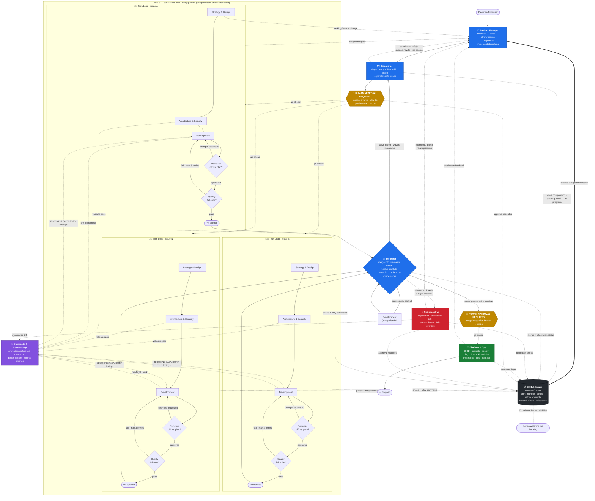
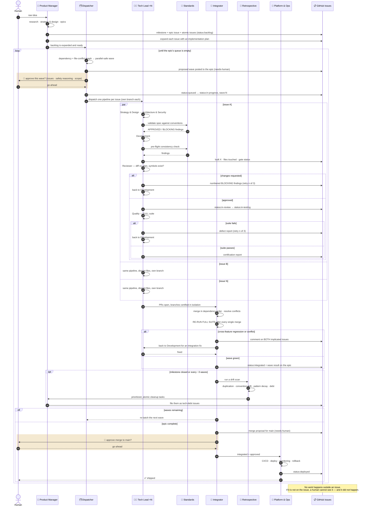
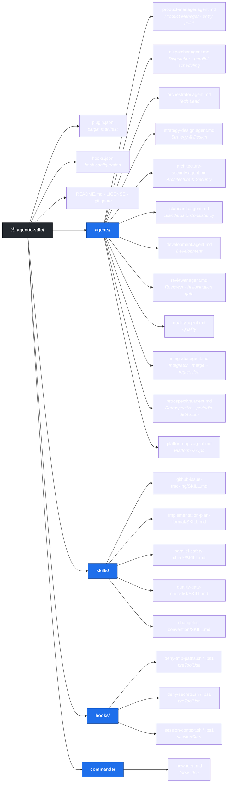

# agentic-sdlc

A GitHub Copilot CLI plugin that packages a complete, opinionated **agentic software development lifecycle** — twelve custom agents that take an idea from a one-sentence prompt all the way to deployed, quality-certified production code, **executing multiple issues in parallel** along the way.

## Why this pattern exists

**The SDLC didn't become obsolete. It became the bottleneck's shape.**

Ideation, design, architecture, implementation, testing, integration, and operations were never bureaucratic overhead — they're the phases where the expensive mistakes get caught. Skipping requirements doesn't remove the requirements work; it relocates it to production. Agents don't repeal any of that. What they change is how fast the *execution* of each phase can happen, which is a genuinely enormous change and also a strictly narrower one than the marketing suggests. Discipline still has to come from somewhere. In this plugin it comes from the pipeline.

**The unit of work is the risk multiplier.** Every failure mode people complain about with coding agents — hallucinated APIs, silent scope creep, tests written to pass rather than to verify, "done" that isn't — scales with how much you hand over at once. Give an agent a vague epic and it will invent the parts it doesn't understand, and it will do so confidently, in a diff too large to review carefully. Give it a precisely specified change to four named files with explicit acceptance criteria, and the same model produces work you can actually verify. Reliability isn't only a property of the model. It's a property of the size and clarity of the request.

**So the core design principle is aggressive decomposition.** Before any autonomous coding happens, a human and the `Product Manager` agent break the idea down — research, stories, epics, and then atomic issues, each small enough for an agent to finish in a single sitting, each with a declared file scope, acceptance criteria, and a definition of done. Decomposition isn't preparation for the real work here. It *is* the work that makes the rest of it safe.

**Small units are what make horizontal scaling possible.** This is the part that pays for the decomposition effort. Atomic issues produce small PRs; small PRs touching disjoint files rarely conflict; work that rarely conflicts can run *concurrently*. That's the entire premise of the `Dispatcher`: if you can prove two issues don't overlap, you can run two full pipelines at once — or six. The constraint on throughput stops being how fast one agent can work and becomes how well the work was decomposed. Decompose better, scale wider. Merge-conflict risk, normally the thing that punishes parallelism, is designed out at the issue level instead of fought at the merge.

**Speed without gates is just faster decay.** Parallelism creates failure modes that no individual pipeline can see: six agents inventing six error-handling conventions, two implementations of the same helper, branches that each pass their own tests and break each other on merge. So every pipeline runs through `Reviewer` (does the diff match the plan, and do the things it calls actually exist?) and `Quality` (does the *entire* suite pass?), consults `Standards & Consistency` so concurrent work converges on one house style, and reconciles through `Integrator`, which re-tests after every merge. `Retrospective` then periodically scans what accumulated anyway and turns it back into scheduled cleanup issues. Velocity gains compound; so does debt. This design assumes both and budgets for both.

**Humans stay where the decisions are irreversible.** This is emphatically not a fire-and-forget system, and the boring parts are automated precisely so attention is available for the parts that matter. You decide what's worth building. You approve which wave of parallel agents gets dispatched. You approve what lands on `main`. And because every agent narrates its work into GitHub Issues as it goes — start, handoff, defect, retry — you can watch a dozen concurrent pipelines from the issue list rather than from twelve scrolling transcripts.

**This is an opinionated pattern, deliberately.** It optimizes for velocity *and* safety at the same time, on the belief that these are complements rather than a tradeoff: the practices that make agent output verifiable — small scope, explicit contracts, mandatory review, full-suite gates, a written audit trail — are the same practices that make it parallelizable. Speed at any cost is easy and gets you a codebase nobody can maintain by month three. The bet here is that a little structure buys a lot more throughput than skipping it ever will.

## In one paragraph

Humans keep ideation and the decisions that are hard to reverse; everything else gets decomposed until it is small enough for an agent to finish safely, then run in parallel. Work is broken into atomic issues an autonomous agent can complete in a single sitting. Those issues are batched into waves that provably don't collide, and each one runs its own full pipeline. Gates catch what speed breaks: a `Reviewer` that verifies the diff against the plan and confirms the code it calls actually exists, a `Quality` agent that certifies the entire suite, an `Integrator` that proves the parallel work still works together, and a `Retrospective` that pays down the drift that accumulates when many agents work at once. The whole run narrates itself into GitHub Issues so it stays legible. Two decisions stay with a human every time: **which wave gets dispatched**, and **what lands on `main`**.

## The agents

The pipeline is built around three coordinators and nine specialists:

- **Product Manager** turns a raw idea into researched GitHub epics (milestones + tracking issues) and atomic, fully-expanded implementation issues.
- **Dispatcher** batches those issues into parallel-safe waves and runs several **concurrent Tech Lead pipelines** — one per issue — after you approve the wave.
- **Tech Lead** takes one issue and orchestrates it through strategy, architecture, development, review, quality, and platform operations — with a 3-retry quality gate.
- **Reviewer** reads the actual diff against the issue's plan before any test runs — the pipeline's hallucination and scope-creep checkpoint.
- **Integrator** merges the finished parallel work back together and re-runs the full suite to catch the cross-feature regressions per-branch testing can't see.
- **Standards & Consistency** keeps N concurrent implementations looking like they were written by one team.
- **Retrospective** runs periodically over the accumulated codebase and turns drift, duplication, and debt back into scheduled backlog issues.

Every agent enforces the same non-negotiables: no shortcuts, no placeholders, no `/tmp`, the **entire** test suite must pass before anything is called done, and **all work is tracked in GitHub Issues** — no work outside an issue, with a comment on every start, handoff, block, defect, and retry, so the issue thread is a live audit trail of the pipeline.

Alongside the agents, the plugin ships **four shared skills** (GitHub issue tracking, implementation plan format, parallel safety check, quality gate checklist), **two hooks** (mechanical `/tmp` denial and session-start pipeline context), and the **`/new-idea` command** that kicks the whole thing off.

## How parallelism works

Per-issue pipelines are only safe if something owns the *scheduling* and something owns the *reconciliation*. That's the Dispatcher/Integrator pair:

- **Dispatcher** reads every open issue under an epic's milestone, extracts each issue's file list and `Blocked by`/`Blocks` links, and builds a dependency + conflict graph. Two issues are serialized if they share a file, a contract, a schema, a migration, or a central registry — otherwise they're parallel-safe. It proposes a **wave** of 2–6 concurrent `Tech Lead` pipelines, **asks you to approve it**, then dispatches each on its own branch, tracks every issue's state, and re-batches the remaining queue after each wave.
- **Reviewer** sits inside every pipeline, between `Development` and `Quality`. It diffs the files actually touched against the file list the wave was batched on, so scope creep is caught while it is still one branch's problem rather than the Integrator's. It also verifies that every symbol the code references genuinely exists — a test written by the same agent that hallucinated an API will happily mock the API it hallucinated.
- **Standards & Consistency** prevents the classic failure of parallel work — six agents inventing six error-handling styles and three HTTP clients. `Architecture & Security` consults it before writing specs that many issues implement against; `Development` runs a pre-flight check against it before review.
- **Integrator** runs when a wave finishes. `Quality` only ever certified each branch *in isolation*, so the Integrator merges them one at a time in dependency order, resolves conflicts preserving both sides' intent, and **re-runs the entire test suite after every single merge** to catch cross-feature regressions. Failures route back to `Development`; a green wave routes back to `Dispatcher` for the next wave, or — **once you approve the merge to `main`** — on to `Platform & Ops`.
- **Retrospective** closes the loop over time. Every individual change can be locally correct and the codebase can still decay: forty issues later there are three date formatters and a test suite twice as slow. No per-issue agent can see that, so `Integrator` triggers a periodic scan that measures the drift, triages it ruthlessly, and hands `Product Manager` a short list of atomic cleanup issues to schedule alongside feature work.

## Where humans stay in the loop

Two gates are hard requirements, not suggestions:

| Gate | Who asks | Why |
|------|----------|-----|
| **Before dispatching a wave** | `Dispatcher` | Spawning N concurrent pipelines is the most expensive, least reversible action in the plugin, taken on the strength of an automated safety analysis. You see the proposed issues, the reasoning for why they're judged parallel-safe, what was deliberately held back, and the estimated scope — then decide. |
| **Before merging to `main`** | `Integrator` | A green suite is necessary, not sufficient. Merging into the *integration* branch happens freely — that's the automated cross-feature testing loop — but putting N features onto the shared trunk is a human call. |

Everything in between runs unattended — but not unobserved. Every agent narrates its own work into the issue thread as it goes, so "unattended" never means "opaque": you can open the repository's issue list at any moment and see which agent is on which issue, what it just finished, what got sent back for rework, and how many retries it has burned. Both gates above are recorded in writing on the epic issue under a `needs-human` label, so approvals are auditable rather than buried in a chat session.

## Pipeline



<details>
<summary>The same pipeline as a sequence of handoffs over time</summary>

The flowchart above shows the topology. This shows the chronology — who talks to whom, in what order, and what lands on the GitHub issue at each step.



</details>

## Installation

```shell
copilot plugin install jmassardo/agentic-sdlc
```

Verify it loaded:

```shell
copilot plugin list
```

Then, in an interactive Copilot CLI session, list the agents it added:

```
/agent
```

To install a local checkout while developing:

```shell
copilot plugin install ./agentic-sdlc
```

To remove it:

```shell
copilot plugin uninstall agentic-sdlc
```

## Usage

The fastest way in is the `/new-idea` command, which drops your raw idea straight into the **Product Manager** agent:

```
/new-idea users should be able to share saved designs with a public link
```

Or invoke the entry-point agent directly:

```
/agent Product Manager
```

> I want users to be able to share their saved designs with a public link.

It will research, delegate story writing to Strategy & Design, create a GitHub milestone and epic tracking issue, break the epic into atomic issues, expand every issue with acceptance criteria and file-level implementation notes, and then hand the backlog to **Dispatcher**. Dispatcher batches the issues into parallel-safe waves and — once you approve the wave — runs several **Tech Lead** pipelines concurrently, each of which runs its own `Reviewer` and `Quality` gates. **Integrator** merges each completed wave, re-runs the full suite before the next wave starts, and asks for your go-ahead before anything reaches `main`. Periodically, **Retrospective** scans what all that parallel work left behind and files cleanup issues back into the backlog.

If you already have a well-specified issue, you can skip straight to **Tech Lead**. If you have a whole expanded backlog and just want it scheduled and executed, start at **Dispatcher**. If you just want requirements and design for something, go directly to **Strategy & Design**. To check on accumulated drift and debt at any time, invoke **Retrospective** directly.

## Agents

| Agent | Role |
|-------|------|
| **Product Manager** | Entry point for new work. Researches the idea (market, technical, competitive, codebase), delegates story writing to Strategy & Design, creates GitHub milestones + epic tracking issues, breaks epics into atomic task issues, and cycles through every issue to write a concrete implementation plan back into it. **Handoffs:** → Strategy & Design (refine requirements), → Tech Lead (execute issue), → Dispatcher (dispatch backlog). |
| **Dispatcher** | Owns the issue queue and dependency graph. Extracts each issue's file list and blockers, builds a conflict graph, batches issues into parallel-safe waves of 2–6, **presents the proposed wave for human approval**, then dispatches one concurrent Tech Lead pipeline per issue on its own branch, tracks every in-flight issue (queued/in-progress/blocked/done), and re-batches the remaining queue after each wave integrates. **Handoffs:** → Tech Lead (dispatch issue), → Integrator (integrate wave), → Product Manager (rescope backlog). |
| **Tech Lead** | Orchestrator for a single issue. Runs it through the full pipeline — strategy, architecture, development, review, quality, ops — accumulating context between phases, tracking progress with todos, applying skip logic, and enforcing the quality gate with up to 3 retry cycles. Under Dispatcher it stays inside its declared file scope, works on its own branch, and stops before deploy. Writes no code itself. **Handoffs:** → Dispatcher (pipeline complete), → Product Manager (update backlog). |
| **Strategy & Design** | Business analysis, product management, work breakdown, UI/UX, accessibility (WCAG 2.1 AA), and documentation planning. Produces INVEST user stories with Given-When-Then acceptance criteria and a complete handoff package. **Handoffs:** → Architecture & Security (design architecture), → Product Manager (update backlog). |
| **Architecture & Security** | System architecture, data models, data engineering, security architecture, compliance, and technical debt management. Turns the story package into technical specs, API contracts, and security controls. **Handoffs:** → Development (start development), → Strategy & Design (refine requirements), → Standards & Consistency (validate against conventions). |
| **Standards & Consistency** | Owns the conventions reference: API/interface contracts, design system and token rules, coding style, shared library usage, and naming. Validates new specs before many parallel issues build against them, runs pre-flight checks on implementations before Quality, and documents genuinely new patterns. Findings are classified BLOCKING or ADVISORY and always cite precedent by file path. **Handoffs:** → Architecture & Security, → Development, → Tech Lead (escalate conflicting precedents). |
| **Development** | Technical leadership and senior implementation. Turns architecture into production-quality code with unit tests — no TODOs, no placeholders, no partial features. Hands off to **Reviewer**, not straight to Quality. **Handoffs:** → Reviewer (code review), → Quality (start testing), → Architecture & Security (security review), → Strategy & Design (fix requirements issue), → Standards & Consistency (consistency pre-flight). |
| **Reviewer** | The hallucination and scope-creep checkpoint, between Development and Quality. Reads the diff against the issue's implementation plan: confirms the change stayed atomic and inside its declared file list, **opens the definition of every referenced import, function, attribute, endpoint, config key, and mock target to prove it exists**, checks the approach matches the architecture spec, traces every acceptance criterion to real code and a real test, and scans for `/tmp` paths, TODOs, stubs, and weakened tests. Runs before Quality so test cycles are never spent on work that's already wrong. **Handoffs:** → Quality (approved), → Development (changes requested), → Architecture & Security (spec is wrong), → Tech Lead (scope creep). |
| **Quality** | Test architecture plus unit, integration, E2E, performance, and security testing. Certifies the **entire** suite for its branch, not just the changed files, and reports defects back for rework. **Handoffs:** → Platform & Ops (deploy to production), → Development (report defects), → Strategy & Design (clarify requirements). |
| **Integrator** | Runs after concurrent pipelines finish. Merges/rebases each PR into the epic's integration branch in dependency order, resolves conflicts preserving both sides' intent, and re-runs the full test suite after **every** merge to catch cross-feature regressions Quality never saw. Verifies migrations apply from scratch and that every issue's acceptance criteria still hold post-merge. **Requires human approval before merging to `main`.** **Handoffs:** → Development (report integration failure), → Dispatcher (wave integrated), → Platform & Ops (deploy epic), → Retrospective (periodic drift scan), → Tech Lead (escalate integration conflict). |
| **Retrospective** | The only agent that isn't per-issue. Runs periodically — at milestone close or every ~3 integrated waves — and scans the accumulated codebase for what no single pipeline can see: duplicated logic introduced by different parallel runs, systematic convention drift, superseded patterns, dead code, debt indicators (TODO count, skipped tests, coverage and suite-runtime trends), and shortcuts taken under pressure. Triages ruthlessly to 5–10 findings, packages each as an atomic remediation task with a file scope, and reports whether debt is being paid down faster than it accrues. **Handoffs:** → Product Manager (file backlog issues), → Standards & Consistency (systematic drift), → Architecture & Security (architectural debt). |
| **Platform & Ops** | Platform engineering, DevOps, SRE, and security operations. Final agent in the chain — reached from Quality in single-issue mode or from Integrator once all waves are integrated and the merge to `main` is approved: infrastructure, CI/CD pipeline definitions, artifact registry and versioning, deployment with rollback, feature-flag rollout and kill switches, monitoring and alerting, and infrastructure cost controls. Cuts releases from `CHANGELOG.md`. **Closes the feedback loop** — production learnings go back to Product Manager for research and decomposition, exactly like a brand-new idea. **Handoffs:** → Development (report app issue), → Architecture & Security (report infra issue), → **Product Manager (new feature request — primary intake)**, → Strategy & Design (refine an already-formed feature). |

## Skills

Shared, agent-agnostic references that keep the pipeline DRY. Several agents cite the same skill so there is exactly one definition of each rule.

| Skill | What it defines | Used by |
|-------|-----------------|---------|
| **`github-issue-tracking`** | The system-of-record convention. No work happens outside a GitHub issue; every agent posts a start comment and a handoff comment mirroring its declared handoffs; blocks, defects, and retry iterations are comments rather than private agent context; a single `status:*` label (`backlog` → `queued` → `in-progress` → `in-review` → `in-testing` → `integrated` → `deployed`, plus `blocked`) tracks pipeline position alongside `agentic-sdlc`, `epic`, `wave:N`, `tech-debt`, and `needs-human`; epics are milestones with a tracking issue; human approvals are recorded in writing. | **All twelve agents** |
| **`implementation-plan-format`** | The canonical template for expanding a GitHub issue into an atomic, autonomous-agent-ready plan — Context, Given-When-Then acceptance criteria, technical approach, an explicit file/module list, test plan, definition of done, out of scope, and `Blocked by:` / `Blocks:` dependencies. Includes the atomicity test and the readiness check. | Product Manager (writes it), Dispatcher (validates against it), Reviewer (enforces its file scope) |
| **`parallel-safety-check`** | Nine serialization rules and an eight-step procedure for deciding whether issues can run concurrently: diff their file scopes, check declared dependencies, detect shared migrations/schemas/contracts/registries/lockfiles, build a maximal safe wave, record the reasoning in the epic, re-batch after every wave. Bias is explicit — when in doubt, serialize. | Dispatcher (batching), Integrator (diagnosing collisions), Retrospective (scoping patterns) |
| **`quality-gate-checklist`** | The single source of truth for "done": the full lint / type-check / unit / integration / E2E / coverage / build suite across the **entire** codebase, the integration-time extras, the `/tmp` prohibition with approved alternatives, and the pass/fail certification report format. | Quality, Tech Lead, Integrator, Reviewer, Development |
| **`changelog-convention`** | Keep a Changelog / SemVer conventions sized for a pipeline that merges dozens of tiny PRs: one entry per *issue* rather than per commit, written in user-facing language when the PR merges, six fixed categories, breaking changes marked explicitly, and flagged-off work held back until the flag is flipped on. Prevents release history fragmenting across atomic PRs. | Integrator (writes entries as waves merge), Platform & Ops (cuts releases and notes from it), Tech Lead |

## Hooks

Three hooks in `hooks.json` back the global rules with mechanical enforcement instead of relying on prose alone.

| Hook | Event | Behavior |
|------|-------|----------|
| **`deny-tmp-paths`** | `preToolUse` | Inspects shell-executing tool calls and **denies** any command referencing a hardcoded `/tmp` or `/var/tmp` path, returning a reason that points at the approved alternatives (`mktemp -d`, `tempfile.mkdtemp()`, pytest `tmp_path`, `fs.mkdtemp()`, `$RUNNER_TEMP`). Ignores non-shell tools and does not trip on `$TMPDIR`, `mktemp`, or paths that merely contain "tmp". |
| **`deny-secrets`** | `preToolUse` | **Denies** shell commands that look like they are about to introduce a credential: private key headers, recognized provider key formats (AWS `AKIA`/`ASIA`, GitHub `ghp_`/`github_pat_`, Slack, OpenAI, Google, GitLab), high-entropy literals assigned to secret-shaped variable names, and `git add`/`git commit` of a real `.env` file. The denial reason points at a secrets manager, runtime environment variables, or a gitignored local config. Placeholders (`your-token-here`, `changeme`), `$VAR` references, and `.env.example` pass through untouched. |
| **`session-context`** | `sessionStart` | Injects a short, persona-agnostic reminder that the session is part of the agentic-sdlc pipeline: stay in whichever agent persona is active, use the declared handoffs rather than doing another agent's job, track all work in GitHub Issues per the `github-issue-tracking` skill, honor the full-suite and no-`/tmp` rules from the `quality-gate-checklist` skill, and remember that wave dispatch and merges to `main` need human go-ahead. |

The `deny-secrets` hook is the security half of this plugin's "velocity **and** safety" premise. Many parallel agents committing fast is exactly the condition under which a credential slips into history — and a leaked secret is the one class of mistake a follow-up commit cannot fix, since rotation is the only real remedy. So it is blocked mechanically at the tool boundary rather than left for `Reviewer` to catch by eye.

All hooks ship as `bash` and `powershell` variants under `hooks/` and always exit `0` — `preToolUse` command hooks are fail-closed, so a script error must never block legitimate work.

## Commands

| Command | What it does |
|---------|--------------|
| **`/new-idea [idea]`** | The front door to the pipeline. Captures a raw idea (prompting for one if not supplied), confirms the target GitHub repository, and hands off to **Product Manager** with instructions to run research → strategy & design → epics → atomic issues → expansion → **Dispatcher**. It deliberately does not design, decide scope, or create issues itself. |

## Repository layout



## Global rules enforced across every agent

- **All tests must pass — the entire suite, every time.** Lint, type checks, unit, integration, E2E, coverage thresholds, and the build. "Pre-existing" and "unrelated" failures still block completion, per branch (Quality) and after every merge (Integrator). Defined in full by the `quality-gate-checklist` skill.
- **Never write to `/tmp` or system temp directories.** Use `tempfile`/`tmp_path`, `fs.mkdtemp`, `mktemp -d`, or `$RUNNER_TEMP`. Enforced mechanically by the `deny-tmp-paths` `preToolUse` hook.
- **Never commit a credential.** Keys, tokens, private keys, and real `.env` files stay out of git — use a secrets manager, runtime environment variables, or gitignored local config. Enforced mechanically by the `deny-secrets` `preToolUse` hook, because rotation is the only remedy once a secret reaches history.
- **Risky and incomplete work ships behind a feature flag.** Architecture & Security specifies the flag, Standards & Consistency owns its naming, Development implements it default-off, Reviewer checks it, Quality tests both states, and Platform & Ops operates the rollout and kill switch. This is what lets atomic PRs merge to `main` before a feature is finished.
- **Observability and cost are design inputs, not afterthoughts.** Specs name the metrics, logs, traces, and alerts a feature needs, and assess its cost shape — unbounded loops over paid APIs, missing pagination, and unbounded retention are caught at design time and re-checked by Reviewer and Retrospective.
- **No shortcuts, no deferrals, no placeholders.** No TODOs, no FIXMEs, no "TBD" acceptance criteria.
- **Respect established patterns and technology choices.** New frameworks or databases require explicit Architecture & Security review with justification, and Standards & Consistency treats duplicate abstractions as BLOCKING.
- **Parallel pipelines stay in their lane.** Concurrent Tech Lead runs work only inside the file scope declared in their issue, on their own branch, and never change shared contracts unilaterally. `Reviewer` enforces this by diffing the files actually touched against the plan.
- **Humans approve the two irreversible steps.** `Dispatcher` asks before spawning a parallel wave; `Integrator` asks before merging to `main`. Silence is not approval, and no agent can grant either one.
- **Verify, don't assume.** `Reviewer` opens the definition of every symbol a change references. "Probably exists" is not verification — unverifiable claims are how hallucinations reach production.
- **All work is tracked in GitHub Issues.** No work starts without an issue; every agent comments on start, on handoff, and on every block, defect, or retry, and keeps one `status:*` label current. Defined in full by the `github-issue-tracking` skill.

## License

MIT © Jenna Massardo
