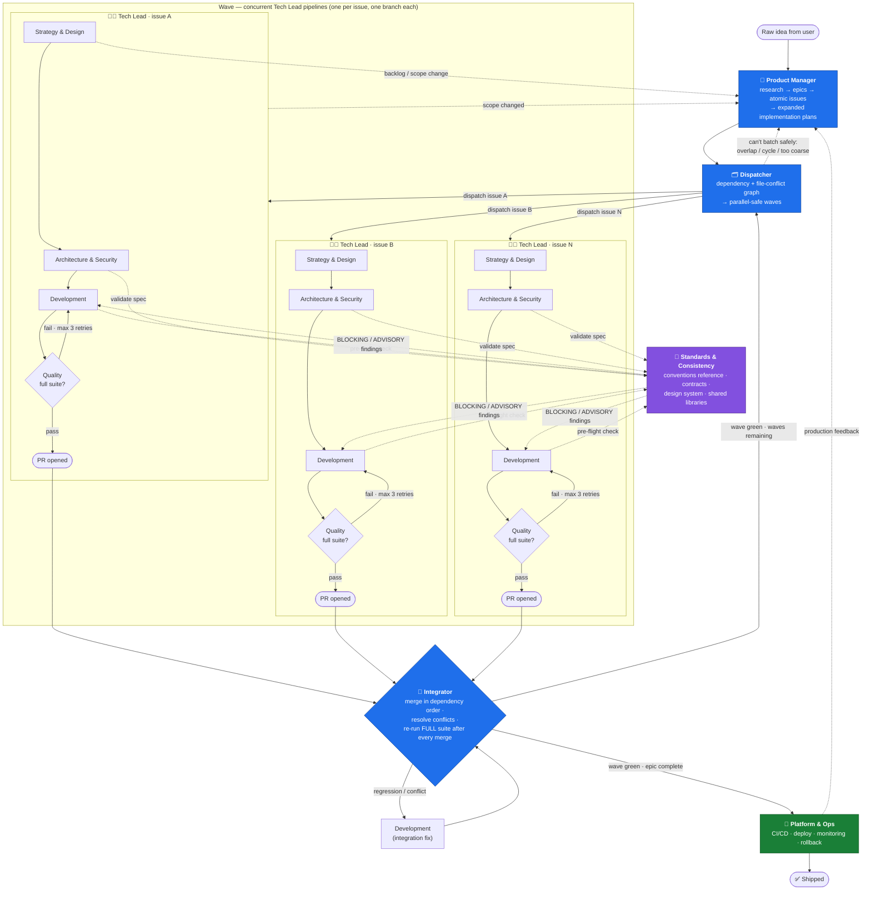

# agentic-sdlc

A GitHub Copilot CLI plugin that packages a complete, opinionated **agentic software development lifecycle** — ten custom agents that take an idea from a one-sentence prompt all the way to deployed, quality-certified production code, **executing multiple issues in parallel** along the way.

The pipeline is built around three coordinators and seven specialists:

- **Product Manager** turns a raw idea into researched GitHub epics (milestones + tracking issues) and atomic, fully-expanded implementation issues.
- **Dispatcher** batches those issues into parallel-safe waves and runs several **concurrent Tech Lead pipelines** — one per issue.
- **Tech Lead** takes one issue and orchestrates it through strategy, architecture, development, quality, and platform operations — with a 3-retry quality gate.
- **Integrator** merges the finished parallel work back together and re-runs the full suite to catch the cross-feature regressions per-branch testing can't see.
- **Standards & Consistency** keeps N concurrent implementations looking like they were written by one team.

Every agent enforces the same non-negotiables: no shortcuts, no placeholders, no `/tmp`, and the **entire** test suite must pass before anything is called done.

Alongside the agents, the plugin ships **three shared skills** (implementation plan format, parallel safety check, quality gate checklist), **two hooks** (mechanical `/tmp` denial and session-start pipeline context), and the **`/new-idea` command** that kicks the whole thing off.

## How parallelism works

Per-issue pipelines are only safe if something owns the *scheduling* and something owns the *reconciliation*. That's the Dispatcher/Integrator pair:

- **Dispatcher** reads every open issue under an epic's milestone, extracts each issue's file list and `Blocked by`/`Blocks` links, and builds a dependency + conflict graph. Two issues are serialized if they share a file, a contract, a schema, a migration, or a central registry — otherwise they're parallel-safe. It dispatches a **wave** of 2–6 concurrent `Tech Lead` pipelines, each on its own branch, tracks every issue's state, and re-batches the remaining queue after each wave.
- **Standards & Consistency** prevents the classic failure of parallel work — six agents inventing six error-handling styles and three HTTP clients. `Architecture & Security` consults it before writing specs that many issues implement against; `Development` runs a pre-flight check against it before handing off to `Quality`.
- **Integrator** runs when a wave finishes. `Quality` only ever certified each branch *in isolation*, so the Integrator merges them one at a time in dependency order, resolves conflicts preserving both sides' intent, and **re-runs the entire test suite after every single merge** to catch cross-feature regressions. Failures route back to `Development`; a green wave routes back to `Dispatcher` for the next wave, or on to `Platform & Ops` when the epic is done.

## Pipeline



<details>
<summary>Same pipeline as an ASCII diagram</summary>

```
                          Raw Idea from User
                                  ↓
        ┌─────────────────────────────────────────────────────┐
        │ Product Manager                                     │
        │  research → epics (milestones + tracking issues)    │
        │  → atomic issues → expanded implementation plans     │
        └─────────────────────────────────────────────────────┘
                                  ↓
        ┌─────────────────────────────────────────────────────┐
        │ Dispatcher                                          │
        │  dependency + file-conflict graph → parallel-safe    │
        │  waves → dispatch one pipeline per issue            │
        └─────────────────────────────────────────────────────┘
                                  ↓
    ┌──────────────┬──────────────┴──────────────┬──────────────┐
    ▼              ▼                             ▼              ▼
┌─────────┐   ┌─────────┐                   ┌─────────┐   ┌─────────┐
│Tech Lead│   │Tech Lead│       ...         │Tech Lead│   │Tech Lead│
│ issue A │   │ issue B │                   │ issue C │   │ issue N │
├─────────┤   ├─────────┤                   ├─────────┤   ├─────────┤
│Strategy │   │Strategy │                   │Strategy │   │Strategy │
│   ↓     │   │   ↓     │                   │   ↓     │   │   ↓     │
│Architect│◄──┼─────────┼── Standards &  ───┼─────────┼──►│Architect│
│   ↓     │   │   ↓     │   Consistency     │   ↓     │   │   ↓     │
│Develop  │──►│ (spec + pre-flight checks)  │◄────────┼───│Develop  │
│   ↓     │   │   ↓     │                   │   ↓     │   │   ↓     │
│Quality  │   │Quality  │                   │Quality  │   │Quality  │
│ ↑fail   │   │ ↑fail   │                   │ ↑fail   │   │ ↑fail   │
│ └─►Dev  │   │ └─►Dev  │  (max 3 retries)  │ └─►Dev  │   │ └─►Dev  │
│   ↓pass │   │   ↓pass │                   │   ↓pass │   │   ↓pass │
│   PR    │   │   PR    │                   │   PR    │   │   PR    │
└────┬────┘   └────┬────┘                   └────┬────┘   └────┬────┘
     └─────────────┴───────────┬───────────────┴──────────────┘
                               ▼
        ┌─────────────────────────────────────────────────────┐
        │ Integrator                                          │
        │  merge/rebase in dependency order → resolve         │
        │  conflicts → RE-RUN FULL SUITE after every merge    │
        │     ├── regression ──► Development (fix)            │
        │     └── green                                       │
        └─────────────────────────────────────────────────────┘
              ↓                                     ↓
    waves remaining                          epic complete
              ↓                                     ↓
        Dispatcher                          Platform & Ops
   (re-batch next wave)                 (CI/CD, deploy, monitor)
                                                    ↓
                                                  ✅ Done
                                                    │
                             backlog / scope change │
                                                    ▼
                                            Product Manager
                                       (revise + re-expand issues)
```

</details>

## Installation

```shell
copilot plugin install jmassardo/agentic-sdlc
```

Verify it loaded:

```shell
copilot plugin list
```

Then, in an interactive Copilot CLI session, list the agents it added:

```
/agent
```

To install a local checkout while developing:

```shell
copilot plugin install ./agentic-sdlc
```

To remove it:

```shell
copilot plugin uninstall agentic-sdlc
```

## Usage

The fastest way in is the `/new-idea` command, which drops your raw idea straight into the **Product Manager** agent:

```
/new-idea users should be able to share saved designs with a public link
```

Or invoke the entry-point agent directly:

```
/agent Product Manager
```

> I want users to be able to share their saved designs with a public link.

It will research, delegate story writing to Strategy & Design, create a GitHub milestone and epic tracking issue, break the epic into atomic issues, expand every issue with acceptance criteria and file-level implementation notes, and then hand the backlog to **Dispatcher**, which batches the issues into parallel-safe waves and runs several **Tech Lead** pipelines concurrently. **Integrator** merges each completed wave and re-runs the full suite before the next wave starts.

If you already have a well-specified issue, you can skip straight to **Tech Lead**. If you have a whole expanded backlog and just want it scheduled and executed, start at **Dispatcher**. If you just want requirements and design for something, go directly to **Strategy & Design**.

## Agents

| Agent | Role |
|-------|------|
| **Product Manager** | Entry point for new work. Researches the idea (market, technical, competitive, codebase), delegates story writing to Strategy & Design, creates GitHub milestones + epic tracking issues, breaks epics into atomic task issues, and cycles through every issue to write a concrete implementation plan back into it. **Handoffs:** → Strategy & Design (refine requirements), → Tech Lead (execute issue), → Dispatcher (dispatch backlog). |
| **Dispatcher** | Owns the issue queue and dependency graph. Extracts each issue's file list and blockers, builds a conflict graph, batches issues into parallel-safe waves of 2–6, dispatches one concurrent Tech Lead pipeline per issue on its own branch, tracks every in-flight issue (queued/in-progress/blocked/done), and re-batches the remaining queue after each wave integrates. **Handoffs:** → Tech Lead (dispatch issue), → Integrator (integrate wave), → Product Manager (rescope backlog). |
| **Tech Lead** | Orchestrator for a single issue. Runs it through the full five-phase pipeline, accumulating context between phases, tracking progress with todos, applying skip logic, and enforcing the quality gate with up to 3 retry cycles. Under Dispatcher it stays inside its declared file scope, works on its own branch, and stops before deploy. Writes no code itself. **Handoffs:** → Dispatcher (pipeline complete), → Product Manager (update backlog). |
| **Strategy & Design** | Business analysis, product management, work breakdown, UI/UX, accessibility (WCAG 2.1 AA), and documentation planning. Produces INVEST user stories with Given-When-Then acceptance criteria and a complete handoff package. **Handoffs:** → Architecture & Security (design architecture), → Product Manager (update backlog). |
| **Architecture & Security** | System architecture, data models, data engineering, security architecture, compliance, and technical debt management. Turns the story package into technical specs, API contracts, and security controls. **Handoffs:** → Development (start development), → Strategy & Design (refine requirements), → Standards & Consistency (validate against conventions). |
| **Standards & Consistency** | Owns the conventions reference: API/interface contracts, design system and token rules, coding style, shared library usage, and naming. Validates new specs before many parallel issues build against them, runs pre-flight checks on implementations before Quality, and documents genuinely new patterns. Findings are classified BLOCKING or ADVISORY and always cite precedent by file path. **Handoffs:** → Architecture & Security, → Development, → Tech Lead (escalate conflicting precedents). |
| **Development** | Technical leadership and senior implementation. Turns architecture into production-quality code with unit tests — no TODOs, no placeholders, no partial features. **Handoffs:** → Quality (start testing), → Architecture & Security (security review), → Strategy & Design (fix requirements issue), → Standards & Consistency (consistency pre-flight). |
| **Quality** | Test architecture plus unit, integration, E2E, performance, and security testing. Certifies the **entire** suite for its branch, not just the changed files, and reports defects back for rework. **Handoffs:** → Platform & Ops (deploy to production), → Development (report defects), → Strategy & Design (clarify requirements). |
| **Integrator** | Runs after concurrent pipelines finish. Merges/rebases each PR into the epic's integration branch in dependency order, resolves conflicts preserving both sides' intent, and re-runs the full test suite after **every** merge to catch cross-feature regressions Quality never saw. Verifies migrations apply from scratch and that every issue's acceptance criteria still hold post-merge. **Handoffs:** → Development (report integration failure), → Dispatcher (wave integrated), → Platform & Ops (deploy epic), → Tech Lead (escalate integration conflict). |
| **Platform & Ops** | Platform engineering, DevOps, SRE, and security operations. Final agent in the chain — reached from Quality in single-issue mode or from Integrator once all waves are integrated: infrastructure, CI/CD, deployment with rollback, monitoring, and alerting. **Handoffs:** → Development (report app issue), → Architecture & Security (report infra issue), → Strategy & Design (new feature request). |

## Skills

Shared, agent-agnostic references that keep the pipeline DRY. Several agents cite the same skill so there is exactly one definition of each rule.

| Skill | What it defines | Used by |
|-------|-----------------|---------|
| **`implementation-plan-format`** | The canonical template for expanding a GitHub issue into an atomic, autonomous-agent-ready plan — Context, Given-When-Then acceptance criteria, technical approach, an explicit file/module list, test plan, definition of done, out of scope, and `Blocked by:` / `Blocks:` dependencies. Includes the atomicity test and the readiness check. | Product Manager (writes it), Dispatcher (validates against it) |
| **`parallel-safety-check`** | Nine serialization rules and an eight-step procedure for deciding whether issues can run concurrently: diff their file scopes, check declared dependencies, detect shared migrations/schemas/contracts/registries/lockfiles, build a maximal safe wave, record the reasoning in the epic, re-batch after every wave. Bias is explicit — when in doubt, serialize. | Dispatcher (batching), Integrator (diagnosing collisions) |
| **`quality-gate-checklist`** | The single source of truth for "done": the full lint / type-check / unit / integration / E2E / coverage / build suite across the **entire** codebase, the integration-time extras, the `/tmp` prohibition with approved alternatives, and the pass/fail certification report format. | Quality, Tech Lead, Integrator, Development |

## Hooks

Two hooks in `hooks.json` back the global rules with mechanical enforcement instead of relying on prose alone.

| Hook | Event | Behavior |
|------|-------|----------|
| **`deny-tmp-paths`** | `preToolUse` | Inspects shell-executing tool calls and **denies** any command referencing a hardcoded `/tmp` or `/var/tmp` path, returning a reason that points at the approved alternatives (`mktemp -d`, `tempfile.mkdtemp()`, pytest `tmp_path`, `fs.mkdtemp()`, `$RUNNER_TEMP`). Ignores non-shell tools and does not trip on `$TMPDIR`, `mktemp`, or paths that merely contain "tmp". |
| **`session-context`** | `sessionStart` | Injects a short, persona-agnostic reminder that the session is part of the agentic-sdlc pipeline: stay in whichever agent persona is active, use the declared handoffs rather than doing another agent's job, and honor the full-suite and no-`/tmp` rules defined by the `quality-gate-checklist` skill. |

Both hooks ship as `bash` and `powershell` variants under `hooks/` and always exit `0` — `preToolUse` command hooks are fail-closed, so a script error must never block legitimate work.

## Commands

| Command | What it does |
|---------|--------------|
| **`/new-idea [idea]`** | The front door to the pipeline. Captures a raw idea (prompting for one if not supplied), confirms the target GitHub repository, and hands off to **Product Manager** with instructions to run research → strategy & design → epics → atomic issues → expansion → **Dispatcher**. It deliberately does not design, decide scope, or create issues itself. |

## Repository layout

```text
agentic-sdlc/
├── plugin.json                          # Plugin manifest
├── hooks.json                           # Hook configuration
├── README.md
├── LICENSE
├── .gitignore
├── agents/
│   ├── product-manager.agent.md         # Product Manager  (entry point)
│   ├── dispatcher.agent.md              # Dispatcher       (parallel scheduling)
│   ├── orchestrator.agent.md            # Tech Lead
│   ├── strategy-design.agent.md         # Strategy & Design
│   ├── architecture-security.agent.md   # Architecture & Security
│   ├── standards.agent.md               # Standards & Consistency
│   ├── development.agent.md             # Development
│   ├── quality.agent.md                 # Quality
│   ├── integrator.agent.md              # Integrator       (merge + regression)
│   └── platform-ops.agent.md            # Platform & Ops
├── skills/
│   ├── implementation-plan-format/SKILL.md
│   ├── parallel-safety-check/SKILL.md
│   └── quality-gate-checklist/SKILL.md
├── hooks/
│   ├── deny-tmp-paths.sh                # preToolUse  (bash)
│   ├── deny-tmp-paths.ps1               # preToolUse  (powershell)
│   ├── session-context.sh               # sessionStart (bash)
│   └── session-context.ps1              # sessionStart (powershell)
└── commands/
    └── new-idea.md                      # /new-idea
```

## Global rules enforced across every agent

- **All tests must pass — the entire suite, every time.** Lint, type checks, unit, integration, E2E, coverage thresholds, and the build. "Pre-existing" and "unrelated" failures still block completion, per branch (Quality) and after every merge (Integrator). Defined in full by the `quality-gate-checklist` skill.
- **Never write to `/tmp` or system temp directories.** Use `tempfile`/`tmp_path`, `fs.mkdtemp`, `mktemp -d`, or `$RUNNER_TEMP`. Enforced mechanically by the `deny-tmp-paths` `preToolUse` hook.
- **No shortcuts, no deferrals, no placeholders.** No TODOs, no FIXMEs, no "TBD" acceptance criteria.
- **Respect established patterns and technology choices.** New frameworks or databases require explicit Architecture & Security review with justification, and Standards & Consistency treats duplicate abstractions as BLOCKING.
- **Parallel pipelines stay in their lane.** Concurrent Tech Lead runs work only inside the file scope declared in their issue, on their own branch, and never change shared contracts unilaterally.

## License

MIT © Jenna Massardo
